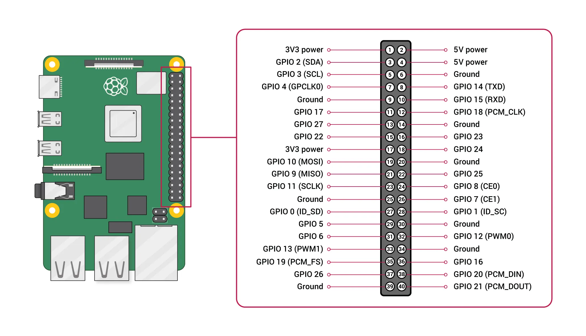

# <ins>Overview</ins>

This README will document the process of me learning kernel development and modifying the Linux kernel for the Raspberry Pi 5.

**Keep in mind, I'm only using this to document my learning experience as this is the first time I'm dabbling in Linux kernel development. This is NOT a How-To guide.**

# <ins>Getting Started</ins>

First, I forked and added the [Linux kernel for Raspberry Pi](https://github.com/Dishoungh/linux-rpi.git) as a submodule.

Now, install the Raspberry Pi Kernel Header files and Device Tree Compiler (DTC): `sudo apt install raspberrypi-kernel-headers device-tree-compiler`

Just for reference, here is the Raspberry Pi 5 Pinout diagram:



# <ins>GPIO</ins>

For this, I want to control Pin 11 (GPIO 17)

Below is the circuit I lazily made on a breadboard, using 1 LED and a 2K resistor.


I added the device tree overlay from "Modules/GPIO/led-demo.dts". 

```
dtc -@ -I dts -O dtb -o ./led-demo.dtbo ./led-demo.dts
sudo dtoverlay ./led-demo.dtbo
dtoverlay -l
```

Since this is my first Linux kernel driver for GPIO, it sucks. I won't worry too much about it. Honestly, I'm just doing this for learning purposes. It's way better to just export/unexport GPIO device files in `/sys/class/gpio/gpiochip571`.

How it works is that GPIO(X) is an offset of GPIO Chip 571. If you check the label for `/sys/class/gpio/gpiochip571/label`, you should get "pinctrl-rp1". This should describe the 40-pin GPIO header.

You can tell by reading the kernel debug files: `cat /sys/kernel/debug/gpio`

For example, GPIO5 should correspond to GPIO ID 571 + 5 = 576. To export that GPIO pin:

`echo 576 > /sys/class/gpio/export`

This should now create `/sys/class/gpio/gpio576`. In this directory, there should be a direction and value file. To set GPIO as input, `echo in > direction`. To set GPIO as output, `echo out > direction`. To set GPIO high, `echo 1 > value`. To set GPIO low, `echo 0 > value`.

# <ins>SPI</ins>

I will play with the SPI interface using the [SH1106 OLED display](https://community.microcenter.com/kb/articles/795-inland-1-3-128x64-oled-graphic-display) I got from MicroCenter. Unfortunately, the device is poorly documented, but according to a comment on one of the reviews, the display chip is a SH1106.

Regardless, just seeing any activity on the SPI lines will be enough for me considering I haven't used my oscilloscope in years lol. Let's keep it real, I'm not going to be wasting a ton of my time troubleshooting this setup. And considering the SH1106 is very similar to the SSD1306, I'll just copy EmbeTronix's implementation.

At this point, I don't even care if it works at all anymore.

I connected the Raspberry Pi to the SH1106 in the following manner (refer to the Pinout diagram above):

- GND  --> Pin 9 (Ground)
- Vcc  --> Pin 1 (3.3V)
- CLK  --> Pin 23 (SCLK)
- MOSI --> Pin 19 (MOSI)
- RES  --> Pin 18 (GPIO 24)
- DC   --> Pin 16 (GPIO 23)
- CS   --> Pin 24 (CE0)

# <ins>I2C</ins>

The device I will be interacting with for I2C is the [CCS811](https://cdn.sparkfun.com/assets/2/c/c/6/5/CN04-2019_attachment_CCS811_Datasheet_v1-06.pdf). Luckily, I found [someone who already made a device driver for it](https://github.com/sss22213/linux_driver_for_AMS_ccs811/tree/master).

Because I'm getting lazier and lazier by the day, I'll just study this guy's driver.

# Conclusion

Disappointingly, I wasn't able to bring myself to wanting to figure out the SH1106 or create a I2C driver on my own. Regardless, I still learned a lot. Unfortunately, I don't have a whole lot of time to mess around with kernel development anymore. But I can always come back here for reference and tackle implmenting a custom SPI and I2C solution with an Arduino Nano acting as the receiving interface device. 

# Helpful References

- [Raspberry Pi 5 Pinout Diagram](https://pinout.ai/raspberry-pi-5)
- [Linux Kernel Source for Raspberry Pi](https://github.com/raspberrypi/linux)
- [Official Linux Kernel Documentation](https://www.kernel.org/doc/html/latest/)
- [EmbeTronix Device Driver Tutorials](https://embetronicx.com/tutorials/linux/device-drivers/linux-device-driver-part-1-introduction/)
- [GPIO Drivers on RPI5](https://emlogic.no/2024/09/linux-drivers-getting-started-with-gpio-on-raspberry-pi-5/)
- [SH1106 Datasheet](https://www.displayfuture.com/Display/datasheet/controller/SH1106.pdf)
- [How to Make a Custom SPI Driver](https://mkmints.wixsite.com/embtech/post/linux-spi-driver-tutorial-building-a-custom-spi-device)
- [CCS811 I2C Driver](https://github.com/sss22213/linux_driver_for_AMS_ccs811/tree/master)