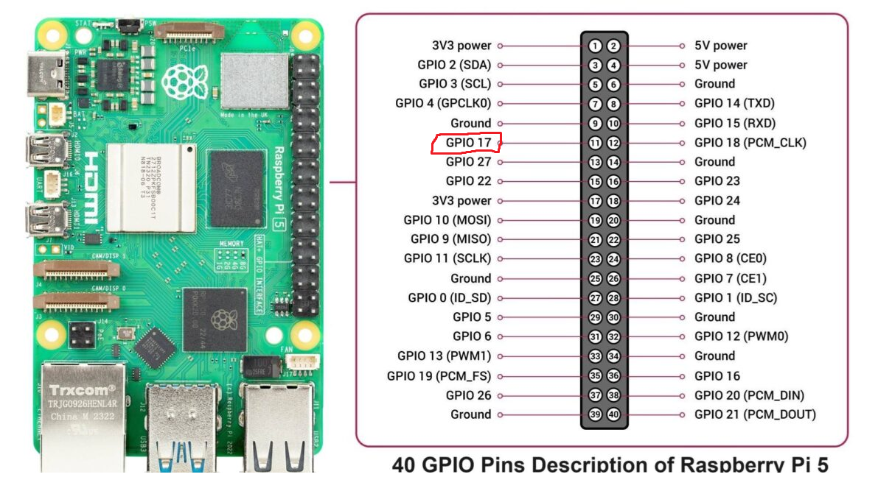

# <ins>Overview</ins>

This README will document the process of me learning kernel development and modifying the Linux kernel for the Raspberry Pi 5.

# <ins>Getting Started</ins>

First, I forked and added the [Linux kernel for Raspberry Pi](https://github.com/Dishoungh/linux-rpi.git) as a submodule.

Now, install the Raspberry Pi Kernel Header files and Device Tree Compiler (DTC): `sudo apt install raspberrypi-kernel-headers device-tree-compiler`

# <ins>GPIO</ins>

For this, I want to control GPIO17 as demonstrated in the image below:



Below is the circuit I lazily made on a breadboard, using 3 LEDs and some resistors.


I added the device tree overlay from "Modules/GPIO/led-demo.dts". 

```
dtc -@ -I dts -O dtb -o ./led-demo.dtbo ./led-demo.dts
sudo dtoverlay ./led-demo.dtbo
dtoverlay -l
```

Since this is my first Linux kernel driver for GPIO, it sucks. I won't worry too much about it. Honestly, I'm just doing this for learning purposes. It's way better to just export/unexport GPIO device files in `/sys/class/gpio/gpiochip571`.

How it works is that GPIO(X) is an offset of GPIO Chip 571. If you check the label for `/sys/class/gpio/gpiochip571/label`, you should get "pinctrl-rp1". This should describe the 40-pin GPIO header.

You can tell by reading the kernel debug files: `cat /sys/kernel/debug/gpio`

For example, GPIO5 should correspond to GPIO ID 571 + 5 = 576. To export that GPIO pin:

`echo 576 > /sys/class/gpio/export`

This should now create `/sys/class/gpio/gpio576`. In this directory, there should be a direction and value file. To set GPIO as input, `echo in > direction`. To set GPIO as output, `echo out > direction`. To set GPIO high, `echo 1 > value`. To set GPIO low, `echo 0 > value`.

# <ins>SPI</ins>

[TBD]

# <ins>I2C</ins>

[TBD]

# Helpful References

- [Official Linux Kernel Documentation](https://www.kernel.org/doc/html/latest/)
- [EmbeTronix Device Driver Tutorials](https://embetronicx.com/tutorials/linux/device-drivers/linux-device-driver-part-1-introduction/)
- [GPIO Drivers on RPI5](https://emlogic.no/2024/09/linux-drivers-getting-started-with-gpio-on-raspberry-pi-5/)